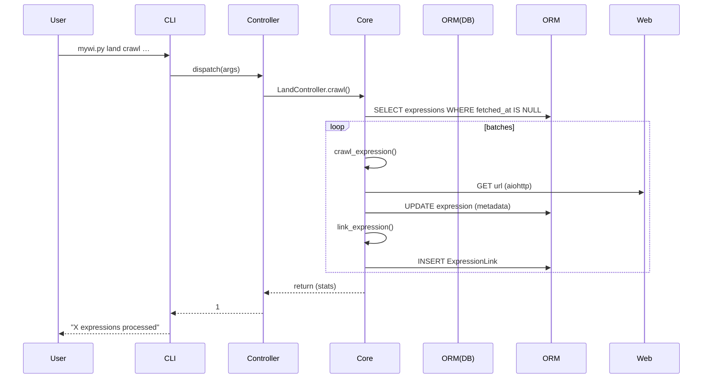

# MyWebIntelligence – Agent Reference Guide  
*(covers `README.md` + every file in `mwi/` and the project entry-points)*  

---

## 1. Big Picture

```
mywi.py  →  mwi/cli.py  →  mwi/controller.py  →  mwi/core.py & mwi/export.py
                                     ↘︎ peewee ORM models (mwi/model.py)
```

* **mywi.py**  
  Console entry-point. Runs `cli.command_input()`.

* **mwi/cli.py**  
  • Converts CLI arguments into a lightweight `argparse.Namespace`.  
  • Dispatches `<object> <verb>` pairs (e.g. `land crawl`) to **controller layer**.  
  • Public helper: `command_run(args_dict)` for programmatic calls (used in tests).

* **mwi/controller.py** – **Thin façade layer.**  
  Maps verbs to *pure* business functions living in **core.py** / **export.py** / **model.py**.  
  Each controller returns `1` on success, `0` on failure (convention reused in tests).

* **mwi/core.py** – **Heart of the application.**  
  Houses every algorithm: crawling, parsing, Mercury/Trafilatura pipelines, relevance scores, async orchestration, heuristic updates, metadata helpers, etc.

* **mwi/export.py** – Centralised exporter (CSV, GEXF nodes, GEXF pages, media lists, zipped raw corpus).  

* **mwi/model.py** – Peewee ORM schema (SQLite WAL mode). Tables:
  `Land`, `Domain`, `Expression`, `ExpressionLink`, `Word`, `LandDictionary`,
  `Media`, `Tag`, `TaggedContent`.

---

## 2. Database Schema (`mwi.db`)

### Table: `Land`
*Purpose: Container for a research project or topic.*

| Column | Type | Constraints | Description |
|---|---|---|---|
| `id` | `INTEGER` | `PRIMARY KEY` | Auto-incrementing ID |
| `name` | `TEXT` | `NOT NULL, UNIQUE` | Project name |
| `description` | `TEXT` | | Optional description |
| `lang` | `TEXT` | | ISO 639-1 language code (e.g., 'fr') |
| `created_at` | `DATETIME` | `DEFAULT CURRENT_TIMESTAMP` | Timestamp of creation |

### Table: `Word`
*Purpose: Stores unique, normalised vocabulary terms.*

| Column | Type | Constraints | Description |
|---|---|---|---|
| `id` | `INTEGER` | `PRIMARY KEY` | Auto-incrementing ID |
| `name` | `TEXT` | `NOT NULL, UNIQUE` | The original word |
| `lemma` | `TEXT` | `NOT NULL, INDEX` | The stemmed/lemmatized form |

### Table: `LandDictionary`
*Purpose: Many-to-many link between `Land` and `Word` defining a project's specific vocabulary.*

| Column | Type | Constraints | Description |
|---|---|---|---|
| `land` | `INTEGER` | `FOREIGN KEY (Land), NOT NULL` | Reference to the Land |
| `word` | `INTEGER` | `FOREIGN KEY (Word), NOT NULL` | Reference to the Word |
*Composite Primary Key on (`land`, `word`)*

### Table: `Domain`
*Purpose: Represents a unique website/domain. Crawled once for general metadata.*

| Column | Type | Constraints | Description |
|---|---|---|---|
| `id` | `INTEGER` | `PRIMARY KEY` | Auto-incrementing ID |
| `name` | `TEXT` | `NOT NULL, UNIQUE` | The domain name (e.g., 'lemonde.fr') |
| `fetched_at` | `DATETIME` | | Timestamp of the last successful crawl |
| `http_status` | `INTEGER` | | HTTP status code from the last crawl |
| `title` | `TEXT` | | `<title>` tag content |
| `keywords` | `TEXT` | | `<meta name="keywords">` content |
| `description` | `TEXT` | | `<meta name="description">` content |
| `created_at` | `DATETIME` | `DEFAULT CURRENT_TIMESTAMP` | Timestamp of creation |

### Table: `Expression`
*Purpose: An individual URL (page, article) belonging to a `Land`.*

| Column | Type | Constraints | Description |
|---|---|---|---|
| `id` | `INTEGER` | `PRIMARY KEY` | Auto-incrementing ID |
| `url` | `TEXT` | `NOT NULL, UNIQUE` | The full URL |
| `html` | `TEXT` | | Raw HTML content (if `settings.archive`) |
| `readable` | `TEXT` | | Cleaned, readable content (Markdown/HTML) |
| `relevance` | `REAL` | `DEFAULT 0.0` | Calculated relevance score |
| `depth` | `INTEGER` | `DEFAULT 0` | Crawl depth from seed URLs |
| `lang` | `TEXT` | | Detected language of the page |
| `title` | `TEXT` | | Page title |
| `description` | `TEXT` | | Page meta description |
| `author` | `TEXT` | | Detected author(s) |
| `published_at` | `DATETIME` | | Detected publication date |
| `domain` | `INTEGER` | `FOREIGN KEY (Domain)` | The domain this URL belongs to |
| `land` | `INTEGER` | `FOREIGN KEY (Land)` | The project this URL belongs to |
| `fetched_at` | `DATETIME` | | Timestamp of the last successful fetch |
| `created_at` | `DATETIME` | `DEFAULT CURRENT_TIMESTAMP` | Timestamp of creation |
*Index on (`land`, `fetched_at`, `readable`)*

### Table: `ExpressionLink`
*Purpose: A directed link from one `Expression` to another.*

| Column | Type | Constraints | Description |
|---|---|---|---|
| `source` | `INTEGER` | `FOREIGN KEY (Expression)` | The page containing the link |
| `target` | `INTEGER` | `FOREIGN KEY (Expression)` | The page the link points to |
*Composite Primary Key on (`source`, `target`)*

### Table: `Media`
*Purpose: An image, video, or audio file found within an `Expression`.*

| Column | Type | Constraints | Description |
|---|---|---|---|
| `id` | `INTEGER` | `PRIMARY KEY` | Auto-incrementing ID |
| `url` | `TEXT` | `NOT NULL` | Full URL of the media file |
| `type` | `TEXT` | | 'img', 'video', or 'audio' |
| `expression` | `INTEGER` | `FOREIGN KEY (Expression)` | The page where the media was found |
*Index on (`expression`)*

### Table: `Tag`
*Purpose: A hierarchical tag for qualitative analysis.*

| Column | Type | Constraints | Description |
|---|---|---|---|
| `id` | `INTEGER` | `PRIMARY KEY` | Auto-incrementing ID |
| `name` | `TEXT` | `NOT NULL` | The tag's name |
| `parent` | `INTEGER` | `FOREIGN KEY (Tag)` | Self-referencing for hierarchy |
| `color` | `TEXT` | | Hex color code for UI |
| `sorting` | `INTEGER` | `DEFAULT 0` | Manual sort order |
| `created_at` | `DATETIME` | `DEFAULT CURRENT_TIMESTAMP` | Timestamp of creation |

### Table: `TaggedContent`
*Purpose: A specific text snippet from an `Expression` that has been assigned a `Tag`.*

| Column | Type | Constraints | Description |
|---|---|---|---|
| `id` | `INTEGER` | `PRIMARY KEY` | Auto-incrementing ID |
| `expression` | `INTEGER` | `FOREIGN KEY (Expression)` | The source page |
| `tag` | `INTEGER` | `FOREIGN KEY (Tag)` | The applied tag |
| `content` | `TEXT` | | The selected text snippet |
| `start` | `INTEGER` | | Character start offset in `Expression.readable` |
| `end` | `INTEGER` | | Character end offset in `Expression.readable` |
| `created_at` | `DATETIME` | `DEFAULT CURRENT_TIMESTAMP` | Timestamp of creation |

---

## 3. End-to-End Workflows

### 3.1 Project Bootstrap

```
python mywi.py db setup
```
* Controller: `DbController.setup` (drops & recreates tables).
* Side-effect: also ensures `settings.data_location` folder exists for future exports.

### 3.2 Land Life-Cycle

1. **Create**  
   ```
   python mywi.py land create --name X --desc ...
   ```  
   → inserts `Land` row, creates `/data/lands/<id>/` directory.

2. **Populate terms**  
   ```
   python mywi.py land addterm --land X --terms "foo, bar baz"
   ```  
   • Each term is stemmed (`core.stem_word`) → `Word`, `LandDictionary`.  
   • Immediately recalculates relevances for existing Expressions in the Land.

3. **Seed URLs**  
   ```
   python mywi.py land addurl --land X --urls "https://site/..." [--path file.txt]
   ```  
   • Each URL normalised `remove_anchor`, checked `is_crawlable`, saved as `Expression`.  
   • Depth = 0 for seeds.

4. **Crawl**  
   ```
   python mywi.py land crawl --name X [--limit N] [--http 404]
   ```  
   • Async batches (size = `settings.parallel_connections`).  
   • For each Expression with empty `readable` it downloads HTML (aiohttp) or archive.org fallback.  
   • `process_expression_content()` extracts metadata, saves HTML archive optionally, computes relevance, link extraction (→ depth+1).

5. **Readable refinement**  
   ```
   python mywi.py land readable --name X [--limit N]
   ```  
   • Strict pipeline: Trafilatura → Mercury Parser CLI → archive.org → raw HTML.  
   • Output stored in `Expression.readable` (markdown / HTML).  
   • Also updates relevance + creates `ExpressionLink`s from markdown links.

6. **Export**  
   ```
   python mywi.py land export --name X --type pagecsv|nodegexf|corpus ...
   ```  
   • Delegates to `core.export_land` → `Export` instance.  
   • Supports seven export variants (see README). File saved under `/data/export_land_<land>_<type>_<timestamp>.*`.

7. **Clean / Delete**  
   ```
   python mywi.py land delete --name X [--maxrel=0.5]
   ```  
   • Delete entire Land (cascade) or low-relevance Expressions only.

### 3.3 Domain Processing

```
python mywi.py domain crawl [--limit N] [--http 503]
```

Pipeline in `core.crawl_domains()`:

1. **Trafilatura fetch_url** (tries https then http).  
2. **Archive.org** JSON endpoint `/wayback/available`.  
3. **Direct requests** (requests.get, allow redirects).

`process_domain_content()` merges metadata from:
* BeautifulSoup selectors (title/description/keywords).  
* Trafilatura `extract_metadata`.  

Results saved in `Domain` row (`fetched_at` set).

### 3.4 Tag-level Export

```
python mywi.py tag export --name X --type matrix|content
```

* **matrix** – wide CSV where columns = hierarchical tag paths, values = snippet counts per Expression.  
* **content** – long CSV with `(tag_path, text, expression_id)`.

### 3.5 Heuristics Update

```
python mywi.py heuristic update
```
* Recomputes domain names for every Expression using regex blacklist/whitelist stored in `settings.heuristics`.

---

## 4. Core Algorithms & Implementation Notes

### 4.1 Relevance Score

```python
title_score   = Σ 10 × hits(lemma)      # heavier weight  
content_score = Σ  1 × hits(lemma)
relevance     = title_score + content_score
```
* Tokenisation with NLTK (`word_tokenize` + FrenchStemmer).
* If page language mismatches Land language → relevance forced to 0.

### 4.2 Async Batching Strategy

```text
expression_count → batch_count = ceil(N / parallel_connections)
```
* For each batch: open single `aiohttp` session w/ limited connector.
* Ensures polite concurrency + predictable memory.

### 4.3 Media Extraction

```python
for tag in ['img','video','audio']:
    src = element['src']
    if img → only `.jpg` kept
    if src startswith '/' → prepend scheme+domain
```
Saved to `Media`, enabling later download pipelines (not present in repo).

### 4.4 Export Helpers

* `Export.get_sql_cursor` builds dynamic SQL by injecting selected columns.  
* GEXF builders write **viz:size** attribute & attributes list.  
* Corpus export zips individual `id-title.txt` files with YAML-like front-matter.

---

## 5. Settings Touch-Points (`settings.py`)

| Variable | Purpose |
|----------|---------|
| `data_location` | Root folder for DB file, archives, exports. |
| `user_agent` | HTTP UA string used by `requests` and `aiohttp`. |
| `parallel_connections` | Concurrency for crawlers. |
| `default_timeout` | Seconds for synchronous requests. |
| `archive` | Boolean → store raw HTML to disk. |
| `heuristics` | Dict of domain regex rules (extract main host from sub-paths). |

---

## 6. Testing Surface

* **tests/test_cli.py** – smoke tests invoking `cli.command_run`.  
* **tests/test_core.py**, `test_expression_metadata.py`… – unit tests for keywords extraction, metadata parsing, export counts.

---

## 7. File-by-File Cheatsheet

| File | Role | Key Functions/Classes |
|------|------|-----------------------|
| `mywi.py` | **entry** | `main()` |
| `mwi/cli.py` | Arg parsing + router | `command_input`, `dispatch`, `command_run` |
| `mwi/controller.py` | Bridges CLI ↔ business | `LandController`, `DomainController`, … |
| `mwi/model.py` | Schema | `Land`, `Expression`, … |
| `mwi/core.py` | Algorithms / I/O | `crawl_land`, `crawl_domains`, `readable_land`, relevance helpers |
| `mwi/export.py` | CSV/GEXF/Corpus writer | `Export.write_*`, `gexf_node`, `export_tags` |
| `settings.py` | Config constants | paths, heuristics, timeouts |

---

## 8. How Everything Fits Together (Sequence)



---

## 9. Extending / Hacking Tips

1. **Add new export format** → implement `Export.write_<type>` and update `valid_types` list in `LandController.export`.  
2. **Change language** → pass `--lang` at `land create`, ensure NLTK stemmer/tokeniser available.  
3. **Add crawler headers / proxy** → edit `settings` or patch `core.crawl_expression` session logic.  
4. **Custom tag schema** → use `Tag` hierarchy; exporting will flatten to `parent_child` concatenation.

---

### End of Agent Guide
